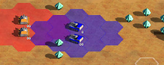
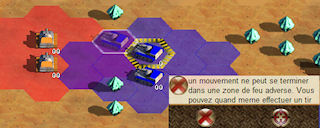
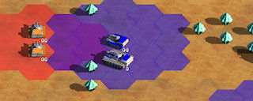
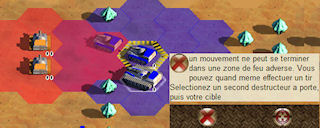
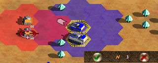
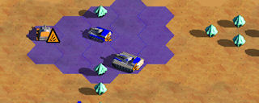
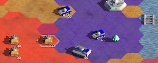
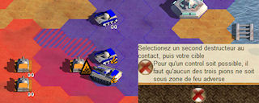
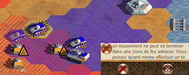
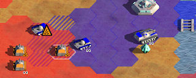

* TOC
{:toc}

Le mécanisme des zones de feu est la clef de voute du jeu. Bien comprises, elles vous permettront de défendre une position ou percer les lignes ennemies.

Un tir réalisé par deux destructeurs sur une cible à portée (2PA) détruit systématiquement celle-ci.
Mais il n’est pas possible de pénétrer dans une zone de feu adverse. C.-à-d. sur une case à portée de deux destructeurs du même propriétaire. Il vous est possible de visualiser ces zones de feu grâce au bouton .
Un destructeur tout seul ne sert donc à rien : il ne peut ni défendre si attaquer.

Attention, un destructeur peut tout de même entrer dans une zone de feu adverse s’il effectue immédiatement un ou deux tirs permettant d’éliminer cette zone de feu.

## Exemple 1
 

 

Les chars ont tous une portée de 2 cases : les chars bleus ne peuvent pas pénétrer dans la zone de feu rouge.

 
 

 
	
Ici la situation est différente, car un char bleu a été remplacé par un gros tas (un destructeur ayant une portée de 3 cases). Il est donc possible de faire pénétrer le char bleu dans la zone de feu rouge et tirer immédiatement.

> les chars sur une montagne ont une portée de 3 cases et les gros tas ne peuvent pas ce déplacer sur les montagnes.
> Une unité neutralisé ne peut pas tirer, mais peut reculer d’une case pour sortir de la zone de feu.

## Exemple 2
	
 
	
Les trois destructeurs bleu aimeraient capturer le char orange, mais malgré sa neutralisation, il est toujours dans une zone de feu adverse.

La neutralisation du char orange a permis au troisième destructeur bleu de s'approcher suffisamment pour neutraliser un second char orange. Le contrôle du premier char orange est maintenant possible.

Attention tout de même, si le gros tas bleu neutralisant s'éloigne alors les chars oranges peuvent neutraliser le char bleu avant que celui-ci ai le temps de remplacer le gros tas dans la neutralisation.

De même, malgré la zone de feu qui semble neutralisé, le char bleu ne peut pas avancer plus, car il effectue lui même la neutralisation. En fait, les destructeurs ne peuvent pas neutraliser pendant leurs déplacements.