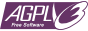

## Disclaimer
Full Metal Galaxy est une adaptation jeu web de Full Metal Planète, un jeu de stratégie sur table de Gérard Mathieu, Gérard Delfanti et Pascal Trigaux, édité par Ludodélire entre 1989 et 1996. Full Metal Galaxy est sous ma seule responsabilité, les auteurs n'ont pas pris part à son développement.

## Remerciements :
- A G.Matthieu pour avoir officieusement autorisé ce site (08/11/07).
- A ma copine chérie qui en a entendu parler quelques heures...
- A Eric Alber pour m'avoir fourni les modèles blender des pions.
- A Brice Vandemoortele pour m'avoir fourni les superbes illustrations de pondeuse météo.
- A Jean-Marc Leroy, l'auteur de full metal program, pour m'avoir fourni son algorithme de génération de carte.
- Aux premiers testeurs, particulièrement Quentin, Manu, Sergio et Bekymy.
- A tous ceux qui m'ont encouragés de près ou de loin.

## Contact
<admin@fullmetalgalaxy.com>

## Licence

Sources dispo ici : <{{ site.github.repository_url }}>

Hébergé par [Github pages](https://pages.github.com/)  et [Google App Engine](https://cloud.google.com/appengine/)
